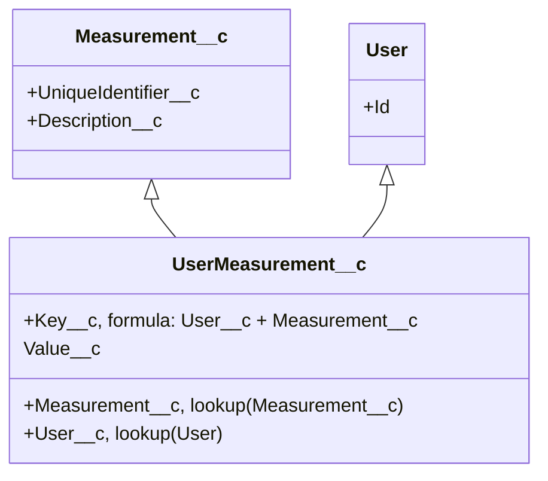
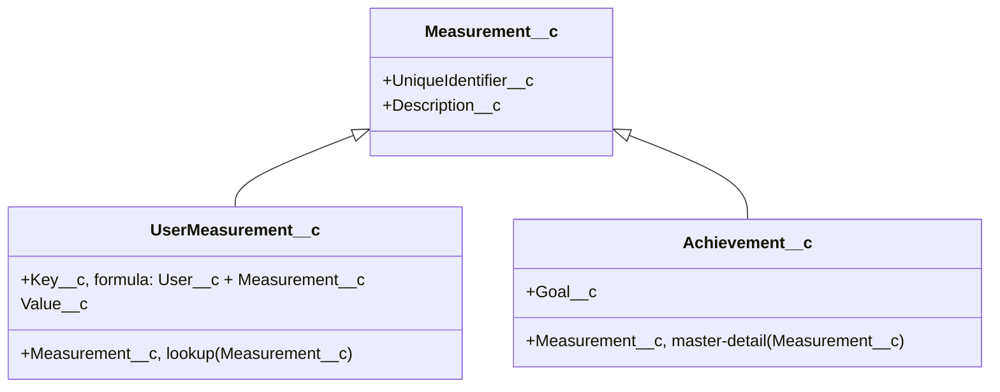

# GameForce data schema
This section is meant to explain some key concepts related to data storage and relathionships between sObjects in GameForce.

## Updating data in sObjects
One key concept is that needs explanation is that in GameForce all the data should be either changed from the UI (by GameForce [admins](PERMISSIONSETSANDGROUPS.md)), or indirectly by firing a specific [platform event](PLATFORMEVENTS.md). 

## Measurement__c and UserMeasurement__c sObjects
`Measurement__c` sObjects stores metrics that are tracked for each individual user, like "Number of converted leads". Specific values per each user are stored in `UserMeasurement__c` sObject.

## Achievement__c sObject
`Achievement__c` sObject stores achievements that are related to specific measurements. Achievement is considred to be reached by user once the value in a corresponding `UserMeasurement__c` record reaches or becomes greater then the value in `Achievement.Goal__c` sObject

This comparison is executed each time `UserMeasurement__c` is created or changed. [`AchievementReachedEventsManager`](../force-app/main/default/classes/AchievementReachedEventsManager.cls) does the comparison and checks if achievement was already reached by the user.